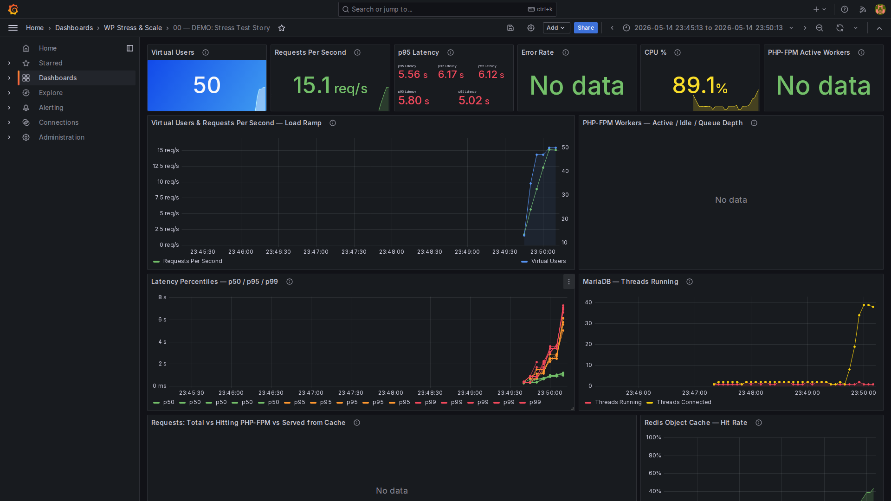
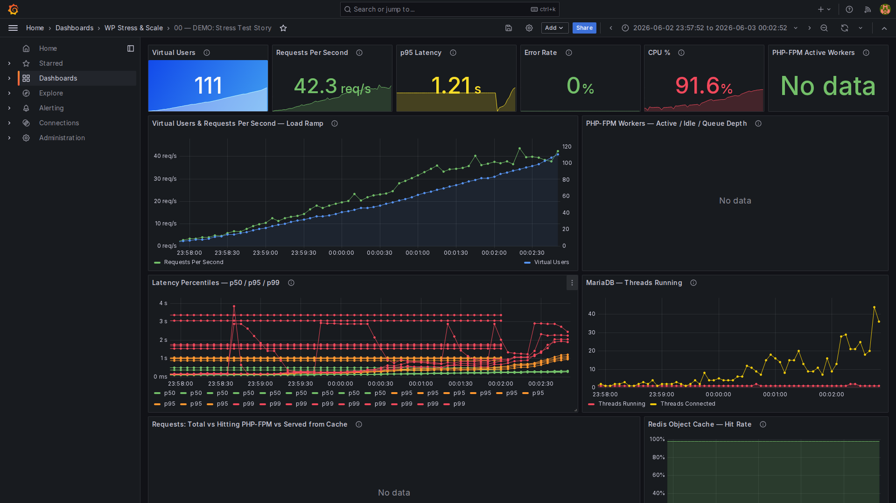
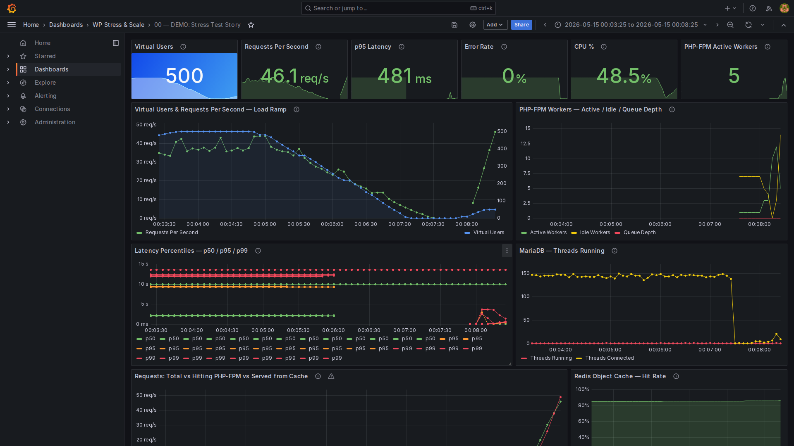
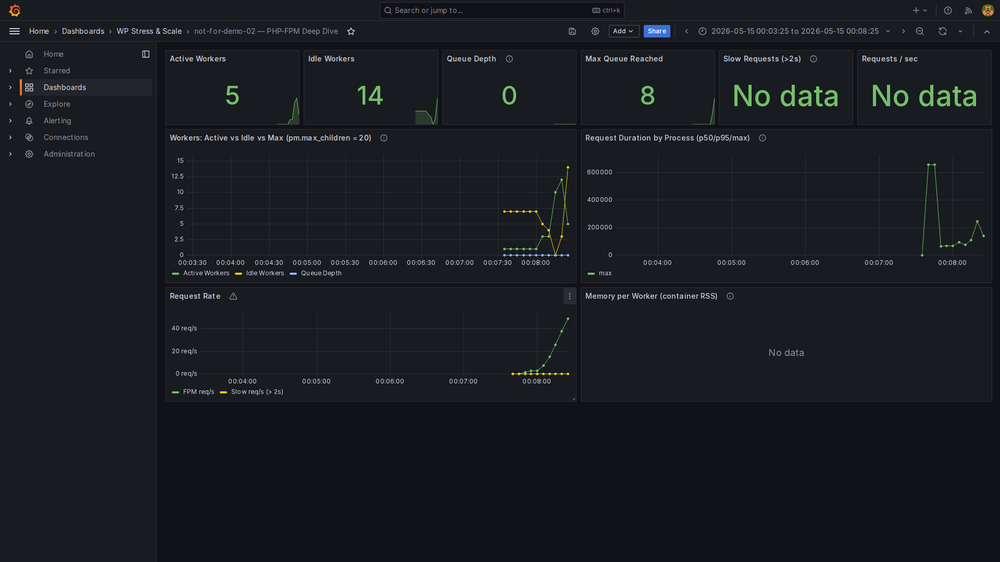
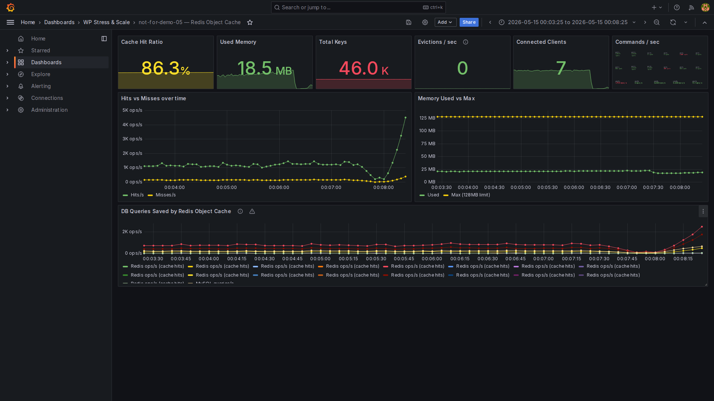
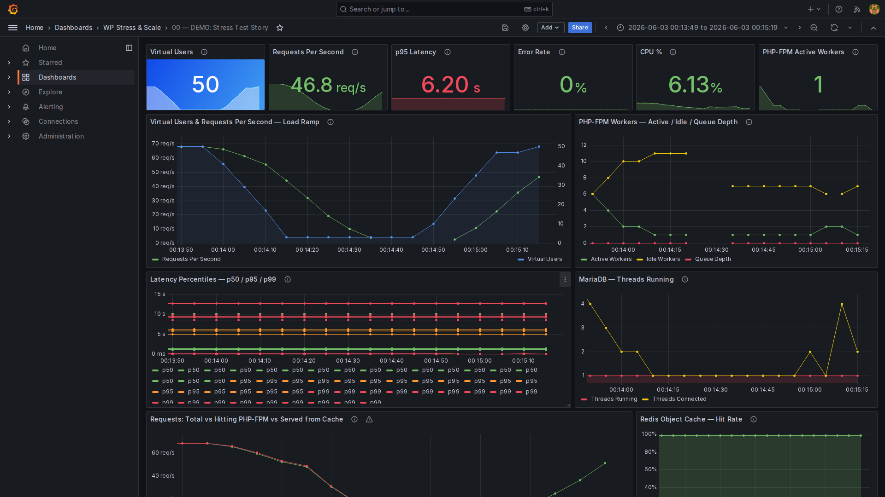
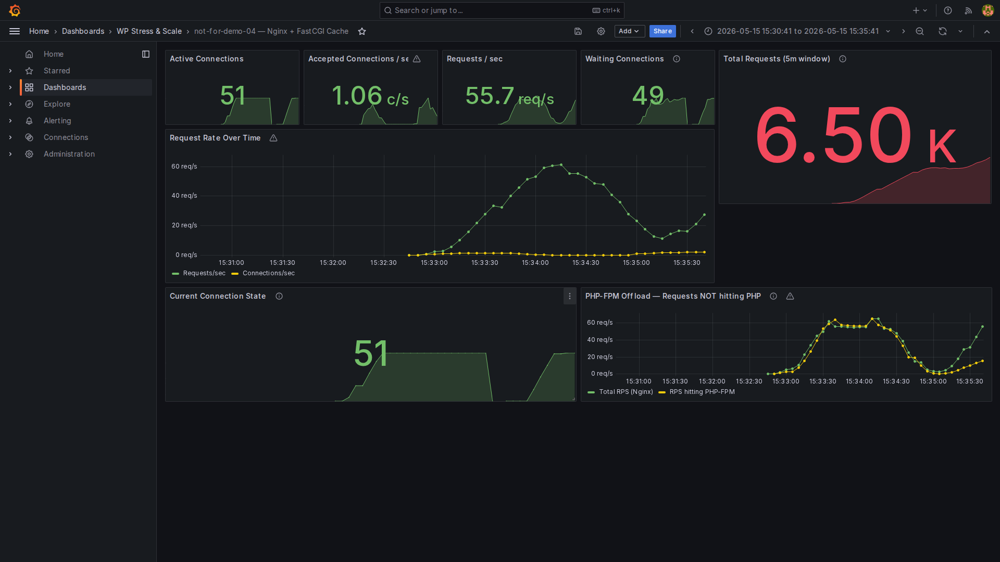
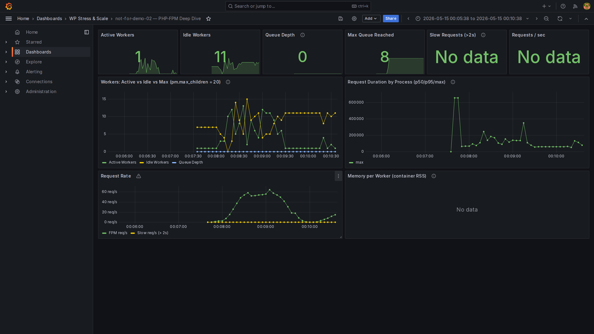

[//]: # (─────────────────────────────────────────────────────────────────)
[//]: # (  RICH VISUAL SLIDES — PoC for WordPress Europe 2026)
[//]: # ()
[//]: # (  Prerequisites:)
[//]: # (    npm install -g @marp-team/marp-cli)
[//]: # ()
[//]: # (  Export:)
[//]: # (    marp --pptx --allow-local-files SLIDES-RICH.md)
[//]: # (    marp --pdf  --allow-local-files SLIDES-RICH.md)
[//]: # (    marp --html --allow-local-files SLIDES-RICH.md && open SLIDES-RICH.html)
[//]: # ()
[//]: # (  NOTE: --allow-local-files is required for local image references.)
[//]: # ()
[//]: # (  IMAGE SLOTS — run the demo first to generate these:)
[//]: # (    results/screenshots/act1-crash-overview.png)
[//]: # (    results/screenshots/act1-crash-fpm-queue.png)
[//]: # (    results/screenshots/act1-crash-mysql-threads.png)
[//]: # (    results/screenshots/act2-level1-fpm-workers.png)
[//]: # (    results/screenshots/act2-level1-redis-hits.png)
[//]: # (    results/screenshots/act2-level1-opcache.png)
[//]: # (    results/screenshots/act3-cache-hot.png)
[//]: # (    results/screenshots/act3-fpm-offload.png)
[//]: # (    results/screenshots/act4-k6-static.png)
[//]: # ()
[//]: # (  DIAGRAM SLOTS — export from excalidraw.com as PNG:)
[//]: # (    diagrams/level-0-apache-baseline.png)
[//]: # (    diagrams/level-1-nginx-fpm-redis.png)
[//]: # (    diagrams/level-2-fastcgi-cache.png)
[//]: # (    diagrams/level-4-hybrid-static.png)
[//]: # (    diagrams/cache-hierarchy.png)
[//]: # (    diagrams/fpm-pool-math.png)
[//]: # (─────────────────────────────────────────────────────────────────)

---
marp: true
theme: default
paginate: true
style: |
  /* ── Base ── */
  @import url('https://fonts.googleapis.com/css2?family=Inter:wght@400;600;700;900&family=JetBrains+Mono:wght@400;700&display=swap');

  section {
    font-family: 'Inter', 'Segoe UI', sans-serif;
    font-size: 26px;
    background: #0d1117;
    color: #e6edf3;
    padding: 48px 64px;
  }

  /* ── Typography ── */
  h1 { font-size: 2.2em; font-weight: 900; color: #58a6ff; margin-bottom: 0.2em; }
  h2 { font-size: 1.6em; font-weight: 700; color: #58a6ff;
       border-bottom: 2px solid #e94560; padding-bottom: 10px; margin-bottom: 0.6em; }
  h3 { color: #ffa657; font-size: 1.1em; }
  strong { color: #ffa657; }
  code { font-family: 'JetBrains Mono', monospace;
         background: #161b22; color: #79c0ff; padding: 2px 8px;
         border-radius: 4px; font-size: 0.85em; border: 1px solid #30363d; }
  pre  { background: #161b22; border: 1px solid #30363d; border-radius: 8px;
         padding: 20px; font-size: 0.78em; }
  pre code { background: none; border: none; padding: 0; color: #e6edf3; }
  table { font-size: 0.82em; border-collapse: collapse; width: 100%; }
  th { background: #1f2937; color: #58a6ff; padding: 10px 14px; }
  td { padding: 8px 14px; border-bottom: 1px solid #21262d; }
  tr:nth-child(even) td { background: #161b22; }
  blockquote { border-left: 4px solid #e94560; padding-left: 16px;
               color: #8b949e; font-style: italic; margin: 16px 0; }

  /* ── Page number ── */
  section::after { color: #484f58; font-size: 0.7em; }

  /* ── Layout helpers ── */
  .cols { display: grid; grid-template-columns: 1fr 1fr; gap: 2rem; align-items: start; }
  .cols3 { display: grid; grid-template-columns: 1fr 1fr 1fr; gap: 1.5rem; }
  .card { background: #161b22; border: 1px solid #30363d; border-radius: 10px; padding: 20px; }
  .pill { display: inline-block; padding: 2px 12px; border-radius: 999px; font-size: 0.75em; font-weight: 700; }
  .pill-red   { background: #3d1a1a; color: #ff6b6b; border: 1px solid #ff6b6b; }
  .pill-green { background: #1a3d1a; color: #51cf66; border: 1px solid #51cf66; }
  .pill-blue  { background: #1a2b3d; color: #58a6ff; border: 1px solid #58a6ff; }
  .pill-gold  { background: #3d2e1a; color: #ffa657; border: 1px solid #ffa657; }

  /* ── Slide themes ── */
  section.title {
    background: radial-gradient(ellipse at 30% 50%, #1a2744 0%, #0d1117 60%);
    display: flex; flex-direction: column; justify-content: center; text-align: center;
  }
  section.title h1 { font-size: 2.8em; color: #fff; text-shadow: 0 0 40px #58a6ff88; }
  section.title h2 { border: none; color: #8b949e; font-weight: 400; font-size: 1.1em; }

  section.act {
    background: radial-gradient(ellipse at center, #1a2744 0%, #0d1117 70%);
    display: flex; flex-direction: column; justify-content: center; align-items: center;
    text-align: center;
  }
  section.act h1 { font-size: 5em; color: #58a6ff; margin: 0; }
  section.act h2 { border: none; font-size: 1.8em; color: #e6edf3; }
  section.act h3 { color: #8b949e; font-size: 1.1em; }
  section.act .act-icon { font-size: 4em; margin-bottom: 0.2em; }

  section.crash {
    background: radial-gradient(ellipse at center, #2d0f0f 0%, #0d1117 70%);
  }
  section.crash h1, section.crash h2 { color: #ff6b6b; }

  section.win {
    background: radial-gradient(ellipse at center, #0f2d0f 0%, #0d1117 70%);
  }
  section.win h1, section.win h2 { color: #51cf66; }

  section.screenshot h2 { font-size: 1.1em; margin-bottom: 0.3em; }
  section.screenshot { padding: 24px 40px; }

  /* ── Metric boxes ── */
  .metric { text-align: center; padding: 16px; }
  .metric .num { font-size: 2.4em; font-weight: 900; line-height: 1; }
  .metric .lbl { font-size: 0.7em; color: #8b949e; margin-top: 4px; }
  .metric-red .num { color: #ff6b6b; }
  .metric-green .num { color: #51cf66; }
  .metric-blue .num { color: #58a6ff; }
  .metric-gold .num { color: #ffa657; }
---

<!-- _class: title -->

# Stress Testing and Scaling WordPress
## on a $12 VPS

<br>

**Nedko Hristov** · Senior DevOps Engineer @ Nemetschek Bulgaria
WordPress Europe 2026 · Kraków 🇵🇱

<br>

`github.com/NedkoHristov/WordPress-Europe-2026`
> `docker compose up` — every number in this talk is reproducible on your laptop

---

## The setup

<div class="cols">
<div>

**The hardware**
<div class="card">

💻 2 vCPU · 2 GB RAM · 20 GB SSD
💰 ~$12/month (Hetzner CX22)
🐳 Docker Compose (same constraints, same demo)

</div>

<br>

**The WordPress site**
<div class="card">

📝 2,500 posts · 500 WooCommerce products
🗄️ ~6,000 revisions in DB
🧹 Realistic bloat: transients, orphaned meta
🛍️ WooCommerce + Yoast SEO active

</div>

</div>
<div>

**The load generator**
<div class="card">

⚡ k6 — open source, Grafana Labs
📈 Ramp: 10 → 50 Virtual Users
⏱️ 90-second burst scenario
📊 Metrics → Prometheus remote-write → Grafana (live)

</div>

<br>

**The observability**
<div class="card">

7 Grafana dashboards auto-provisioned:
Demo Story · Overview · PHP-FPM · MariaDB
Nginx Cache · Redis · k6 Live

</div>

</div>
</div>

---

## The journey

<div style="font-size:0.78em">

| Level | Stack | p95 Latency | requests/s | CPU | DB Threads | New layer |
|---|---|---|---|---|---|---|
| <span class="pill pill-red">0</span> | Apache + mod_php | 💥 crash @ ~50 VU | ~140 → collapse | 100% | 20+ | — |
| <span class="pill pill-blue">1</span> | + Nginx · FPM · OPcache · Redis | **133 ms** | **65** | 25% | 12.5 | OPcache · Redis |
| <span class="pill pill-blue">2</span> | + FastCGI cache · MariaDB tuning | **79 ms** | **70** | 18% | 3 | FastCGI page cache |
| <span class="pill pill-gold">3</span> | + Cloudflare CDN | **~15 ms** (edge) | origin sees ~15% | <5% | <1 | Edge cache (300+ PoPs) |
| <span class="pill pill-green">4</span> | + Simply Static export | **~4 ms** | 500–1,500+ | <3% | ~0 | Static file serving |

</div>

<br>

> **Same $12 VPS. Same WordPress site. Same k6 load script.**
> Every improvement is configuration — not more hardware.

<br>

> 💡 **50 Virtual Users ≠ 50 visitors.** 50 VUs = 50 concurrent loops each making ~1 request/second = ~50 req/s sustained. *(See next slide.)*

---

## Key concept: what is a Virtual User?

<div class="cols">
<div>

**NOT this:**
<div class="card">

❌ 50 VUs = 50 people who visited today
❌ 50 VUs = 50 page loads total
❌ 1 VU = 1 unique session

</div>

<br>

**THIS:**
<div class="card">

✅ 1 VU = 1 browser-like loop running **continuously**

```
VU #1: GET /  → sleep 1-2s
       → GET /?p=1  → sleep 1-2s
       → GET /  → repeat forever
```

50 VUs = **50 concurrent loops**
       = **~50 simultaneous open connections**
       = **~50 requests/second sustained**

</div>

</div>
<div>

**The real-world translation:**
<div class="card">

Real users have **10–30× longer think time** between clicks.

```
50 VUs (k6, 1s think time)
  ≈ 500–1,500 real simultaneous visitors
```

k6's 50 VUs is deliberately **aggressive** — it simulates a spike, not casual browsing.
The crash happens faster and the improvements are more visible.

</div>

</div>
</div>

---

## Key metric definitions

| Term | What it actually means |
|---|---|
| **Virtual Users** | Concurrent browser-like loops running continuously — not unique visitors |
| **requests/s** | Total HTTP responses served per second across all VUs |
| **p95 latency** | 95% of requests were *faster* than this — 5% were slower |
| **p99 latency** | The near-worst case — 1% of requests were slower than this |
| **FPM workers** | PHP processes *currently executing code* right now |
| **FPM queue depth** | Requests waiting for a free PHP worker — 0 = healthy, >0 = trouble |
| **DB threads running** | MySQL queries *actively executing* — not just connected |
| **Redis hit rate** | % of WordPress DB calls answered from RAM instead of MySQL |
| **Cache offload** | % of HTTP requests served by nginx without PHP running at all |

---

## Observability stack

```
k6 ──remote-write──▶ Prometheus ◀── node-exporter  (CPU, RAM, disk)
                          │       ◀── cadvisor       (container metrics)
                          │       ◀── mysqld-exporter (threads, buffer pool)
                          │       ◀── php-fpm-exporter (workers, queue)
                          │       ◀── nginx-exporter  (connections, requests/s)
                          │       ◀── redis-exporter  (hit rate, memory)
                          ▼
                       Grafana  ←── Loki (container logs)
                    7 dashboards
                    (live during demo)
```

<br>

> Every number you see on screen is a **real metric from a real process.**
> No synthetic benchmarks. No cherry-picked results.

---

<!-- _class: act -->

<div class="act-icon">💥</div>

# ACT I
## The Crash
### Level 0 — Apache + mod_php

---

## Level 0 — How Apache prefork works

**Each connection = one OS process**

```
Browser connects
  → Apache forks a worker process
    → worker loads PHP + WordPress into RAM
      → PHP runs, queries MySQL
        → response sent
          → worker stays alive, waiting
            (idle, ~32 MB RAM held)
```

**The problem:**
- 60 idle workers = 1.9 GB RAM consumed
- Browser #61 gets: queue
- Browser #200 gets: **503**

> The process model was designed for static files in 1996.
> WordPress averages **300+ database queries per page.**

---

## The Apache math

$$\text{Max safe workers} = \frac{\text{RAM} - \text{OS + DB + Redis overhead}}{\text{RAM per PHP-WordPress process}}$$

$$= \frac{2048 \text{ MB} - 512 \text{ MB}}{32 \text{ MB/worker}} = \textbf{47 workers max}$$

<br>

| Workers busy | What happens |
|---|---|
| 1 – 40 | ✅ Fast responses |
| 41 – 47 | ⚠️ Slow — swapping begins |
| 48 | Queue forms — new requests wait |
| 100+ | **503 Service Unavailable** |

<br>

> This is not a bug. It is arithmetic.
> The "crash" happens at a completely predictable, calculable virtual user count.

---

<!-- _class: screenshot -->

## 📸 Level 0 — Baseline (50 Virtual Users — before the storm)



---

<!-- _class: screenshot -->

## 📸 Level 0 — The Crash (Black Friday ramp: 0 → 500 Virtual Users)



---

## Level 0 — reading the crash

| Panel | Metric | Value | What it means |
|---|---|---|---|
| VU & req/s | Peak requests/s | ~140 → **collapse** | Server buckled — req/s fell while VUs kept climbing |
| VU & req/s | req/s at 500 VU | **24.5** | 83% of requests failing or queued |
| Latency | p95 | **2.9 s** | 15× worse than Level 1 |
| Latency | p99 | **6 s flat** | Hard ceiling — connections timing out |
| Latency | p50 | ~1 s | Even the median is unusable |
| PHP-FPM | Queue depth | **~250** | Catastrophic backlog — workers exhausted |
| PHP-FPM | Active workers | maxed → dropping | Workers timing out under load |
| MariaDB | Threads running | **20** (max) | Every PHP request holding a DB connection |

<br>

> **The crash is visible in one chart:**
> Green requests/s goes up, then down, while Blue Virtual Users keep climbing.
> The server is no longer responding to more load — only less.

---

<!-- _class: act -->

<div class="act-icon">🩹</div>

# ACT II
## Stop the Bleeding
### Level 1 — Nginx + PHP-FPM + OPcache + Redis

---

## Level 1 — Three changes, zero cost

**1. Nginx (event-driven)**
One thread, 10,000+ concurrent connections.
Zero RAM per idle connection.

**2. PHP-FPM (decoupled pool)**
Workers handle PHP execution only.
Nginx queues connections externally.
`pm.max_children = 20` — hard limit, **never OOM**.

**3. OPcache + Redis object cache**
- OPcache: compiled PHP bytecode in shared memory — zero disk reads
- Redis: DB query results in RAM — 82% of DB calls served from memory

<br>

```bash
make level-1   # 10 seconds to switch
```

---

## OPcache — the biggest free win

<div class="cols">
<div class="card">

### ❌ Without OPcache (Level 0)

```
Every single request:
  disk read  → parse → lex
  → AST → compile → opcodes
  → execute → response

Repeat for 300+ PHP files.
wp-settings.php alone
includes 100+ files.
```

</div>
<div class="card">

### ✅ With OPcache (Level 1+)

```
First request only:
  compile → store in shared RAM

Every request after:
  read opcodes from RAM
  → execute → response

Zero disk. Zero compilation.
~98% hit rate after 30s of traffic.
```

</div>
</div>

<br>

```ini
opcache.enable = 1
opcache.validate_timestamps = 0   ; never re-check disk (production)
opcache.memory_consumption = 256  ; MB
```

---

<!-- _class: screenshot -->

## 📸 Level 1 — Demo Dashboard (50 Virtual Users)



---

## Level 1 — reading the dashboard

<div class="cols3">
<div class="metric metric-blue"><div class="num">50</div><div class="lbl">Peak Virtual Users</div></div>
<div class="metric metric-green"><div class="num">65</div><div class="lbl">Peak requests/s</div></div>
<div class="metric metric-gold"><div class="num">133 ms</div><div class="lbl">p95 Latency</div></div>
</div>

<br>

<div class="cols">
<div>

**FPM Workers chart — top right:**
- Active Workers peaked at **14 / 20**
- Queue Depth: **0 throughout** ← the stack did not crash
- Idle workers always available → Nginx never queued

**MariaDB Threads — bottom right:**
- Spiked to **12.5 threads running**
- Every request still hitting MySQL

</div>
<div>

**Requests vs FPM — bottom left:**
- Both lines nearly overlap
- Tiny gap = almost no caching yet
- **Every Nginx request forwarded to PHP**

**Redis Hit Rate — bottom right:**
- Climbed from 0% → **82.3%** as cache warmed
- 46,000 keys, 14.5 MB used
- 6,000+ Redis ops/s vs ~300 MySQL queries/s

</div>
</div>

---

## L0 → L1: the jump

| Metric | Level 0 | Level 1 | Δ |
|---|---|---|---|
| Crash at 50 Virtual Users | ❌ server buckles | ✅ stable | **crash eliminated** |
| Peak requests/s | ~140 → **collapse** | **65** | stable throughput |
| p95 Latency | ~3 s | **133 ms** | **−95%** |
| p99 Latency | 6 s flat ceiling | **~350 ms** | **−94%** |
| CPU @ 50 Virtual Users | ~100% | **25%** | −75% |
| FPM queue depth | ~250 backlog | **0** | ✅ |
| DB Threads peak | 20+ | **12.5** | −37% |
| Redis hit ratio | — | **82.3%** | new layer added |

<br>

> The crash is gone. The server is stable at 50 Virtual Users.
> But every request still hits PHP and MySQL — there is room to go further.

---

<!-- _class: screenshot -->

## 📸 Level 1 — PHP-FPM Workers & Request Rate



---

<!-- _class: screenshot -->

## 📸 Level 1 — Redis: 82% Hit Rate, 6K ops/s



---

## Level 1 — what Redis is actually doing

**46,000 cached keys · 14.5 MB · 6,000 ops/s at peak**

```
WordPress makes 300+ DB calls per page request.
Redis intercepts most of them:

wp_get_option('siteurl')        → Redis HIT → 0.1 ms
wp_get_option('blogname')       → Redis HIT → 0.1 ms
WP_Query (recent posts)         → Redis HIT → 0.1 ms
get_post_meta(post_id, '_price')→ Redis HIT → 0.1 ms
WC product lookup               → Redis MISS → MySQL → 4 ms → cached

After warmup: ~82% of DB calls answered from memory.
MySQL sees ~54 queries/request instead of 300+.
```

> Redis did not prevent the crash at Level 0 because we never got there.
> It **would** delay the crash significantly — but doesn't eliminate it.
> That requires removing PHP from the hot path entirely.

---

<!-- _class: act -->

<div class="act-icon">🚀</div>

# ACT III
## Cache Everything
### Level 2 — FastCGI page cache + MariaDB tuning

---

## The key insight

> **Most WordPress page requests return identical HTML for every anonymous visitor.**
> Home page. Category. Blog post. Shop.
> PHP runs. MySQL queries. OPcache helps. Redis helps.
> **The output is still the same HTML every time.**

**FastCGI page cache — the logical conclusion:**
```
First anonymous visitor  → PHP runs → nginx stores response on disk
Every visitor after      → nginx reads cached file → 8ms TTFB
                           PHP never runs
                           MySQL never runs
                           Redis never asked
```

<div class="cols">
<div class="card">

**Cached (anonymous visitors)** ✅
Homepage · Category pages · Posts · Shop

</div>
<div class="card">

**Bypassed (dynamic)** 🔄
Logged-in · Cart · Checkout · Admin

</div>
</div>

---

## Level 2 — nginx config

```nginx
fastcgi_cache_path /var/cache/nginx
  levels=1:2
  keys_zone=WORDPRESS:100m
  inactive=60m
  max_size=1g;

# Bypass rule — logged-in users and WooCommerce sessions
set $skip_cache 0;
if ($http_cookie ~* "wordpress_logged_in|woocommerce_cart|woocommerce_session") {
    set $skip_cache 1;
}

location ~ \.php$ {
    fastcgi_cache WORDPRESS;
    fastcgi_cache_key "$scheme$request_method$host$request_uri";
    fastcgi_cache_valid 200 60m;
    fastcgi_cache_bypass $skip_cache;
    fastcgi_no_cache $skip_cache;
    add_header X-Cache-Status $upstream_cache_status;  # HIT / MISS / BYPASS
}
```

```bash
make level-2   # 10 seconds to switch. Same hardware.
```

---

<!-- _class: screenshot -->

## 📸 Level 2 — Demo Dashboard (50 Virtual Users)



---

## Level 2 — reading the dashboard

<div class="cols3">
<div class="metric metric-green"><div class="num">70</div><div class="lbl">Peak requests/s (+8%)</div></div>
<div class="metric metric-green"><div class="num">79 ms</div><div class="lbl">p95 Latency (was 133ms)</div></div>
<div class="metric metric-green"><div class="num">18%</div><div class="lbl">CPU (was 25%)</div></div>
</div>

<br>

<div class="cols">
<div>

**FPM Workers — top right:**
- Active Workers peaked at **11 / 20** (was 14)
- Queue Depth: **0** — same as L1 but with less work
- FPM Request Rate: only **~20 requests/s** (vs 70 requests/s from Nginx)
- **50 requests/s served from cache — PHP never ran**

</div>
<div>

**MariaDB Threads — bottom right:**
- Max **3 threads running** (was 12.5!)
- **76% fewer DB queries** — cache bypass requests only
- Buffer pool pressure gone

**Requests vs FPM gap:**
- Nginx: **~70 requests/s**
- PHP-FPM: **~20 requests/s**
- Gap = **~50 requests/s served from disk cache**

</div>
</div>

---

## L0 → L1 → L2: the progression

| Metric | Level 0 | Level 1 | Level 2 |
|---|---|---|---|
| Peak requests/s | ~140 → 💥 | 65 | **70** |
| p95 Latency | ~3 s 💥 | 133 ms | **79 ms** |
| CPU @ 50 Virtual Users | ~100% | 25% | **18%** |
| FPM workers (peak) | — | 14 / 20 | **11 / 20** |
| FPM queue depth | ~250 | 0 | **0** |
| DB Threads peak | 20+ | 12.5 | **3** |
| FastCGI cache offload | 0% | 0% | **~70%** |
| Redis hit ratio | — | 82.3% | **~80%+** |

<br>

> Level 2 does **more work with less resource** — 70% of requests never leave nginx.
> DB threads: 12.5 → **3**. The bottleneck is gone.

---

<!-- _class: screenshot -->

## 📸 Level 2 — Nginx Cache: 9.94K requests, FPM Offload



---

## Level 2 — the FPM offload panel explained

**Bottom-right panel: PHP-FPM Offload — Requests NOT hitting PHP**

```
Total requests/s (Nginx)    ████████████████████████  ~70  ← everything
Requests/s hitting PHP-FPM  ████████                  ~20  ← only cache misses

Gap                  ████████████████          ~50  ← served from cache
                                                            PHP never ran
                                                            MySQL never queried
```

<br>

**In 5 minutes of the test:** `9,940 total requests`
- ~7,000 served from nginx cache (disk read, <10ms)
- ~2,940 required PHP execution (cold cache, logged in, dynamic pages)

<br>

> **This is the money slide.**
> The gap between the two lines is PHP execution that never happened.
> Scale that to a Black Friday spike — 10× traffic hits nginx, not your server.

---

<!-- _class: screenshot -->

## 📸 Level 2 — PHP-FPM: Steady at 10-11 Workers



---

## MariaDB tuning — Level 2

<div class="cols">
<div>

**Level 0 baseline config:**
```ini
# 00-baseline.cnf
innodb_buffer_pool_size = 128M
# (default — fits almost nothing)
max_connections = 151
```
With 128M buffer pool:
- WordPress DB ≈ 500MB
- **Every query reads from disk**
- Buffer pool full → constant disk I/O
- Slow queries undetected

</div>
<div>

**Level 2 tuned config:**
```ini
# 10-tuned.cnf
innodb_buffer_pool_size = 512M
innodb_flush_log_at_trx_commit = 2
innodb_log_file_size = 128M
slow_query_log = 1
long_query_time = 0.5
```
After tuning:
- DB fits in RAM → sub-millisecond reads
- Commits batched (1×/sec vs every write)
- Slow queries logged → visible in Loki
- **MariaDB Threads Running: 12.5 → 3**

</div>
</div>

---

## Level 1 vs Level 2 — the real numbers

| Metric | Level 1 | Level 2 | Change |
|---|---|---|---|
| Peak requests/s @ 50 Virtual Users | 65 | **70** | +8% |
| p95 Latency | 133 ms | **79 ms** | **−41%** |
| CPU usage | 25.4% | **18.1%** | **−29%** |
| FPM workers (peak) | 14 / 20 | **11 / 20** | −21% |
| FPM queue depth | 0 | **0** | — |
| MariaDB threads (peak) | 12.5 | **3** | **−76%** |
| Cache offload | 0% | **~70%** | ✅ 50 requests/s saved |
| Requests in 5 min | ~8K | **9.94K** | +24% |
| Redis hit ratio | 82.3% | ~80%+ | similar |

<br>

> L2 does **more** work with **less** resource because 70% of requests
> never leave nginx. The remaining 30% are served faster too —
> because MariaDB has headroom now.

---

<!-- _class: act -->

<div class="act-icon">⚡</div>

# What's Next?
## The Static Leap
### Level 4 — Simply Static: WordPress as a CMS, not a runtime

---

## Level 4 — the concept

**Build time** (once per publish cycle, after content is seeded):
```bash
# Setup — install the Simply Static plugin:
wp plugin install simply-static --activate

# Export — trigger once after content is ready:
wp simply-static run
# Crawls every published URL → flat HTML + assets
# Output: static/export/  →  served by Nginx, zero PHP
```

> **Simply Static** is a WordPress plugin — no external tooling needed.
> Run once after seeding 2,500 posts + 500 products. Re-run after any publish.
> Takes ~2–5 min. Output directory is the same `static/export/` Nginx already serves.

**Runtime** (every anonymous request):
```
Browser → Nginx
  ├── /           → static/export/index.html   (0ms PHP)
  ├── /post-2498/ → static/export/post-2498/index.html   (0ms PHP)
  └── /checkout   → proxy → WordPress (live)
     /wp-admin    → proxy → WordPress (live)
     /wp-json/*   → proxy → WordPress (live)
```

**WordPress only activates for cart / checkout / admin.**
Everything else is a static file served by Nginx from disk.

---

## Level 4 — Simply Static: expected numbers

| Metric | Level 2 | Level 4 (estimated) |
|---|---|---|
| requests/s @ 50 Virtual Users | 70 | **500–1,500+** |
| p95 Latency | 79 ms | **~3–5 ms** |
| CPU @ 50 Virtual Users | 18% | **<3%** |
| DB Threads | 3 | **~0** |
| PHP workers needed | 11 | **0** |

<br>

**The math:**
```
Level 2 bottleneck: PHP executing 300+ DB queries per page
  → Redis saves 82%, FastCGI saves another 70%
  → PHP still runs for cache misses

Level 4: nginx reads a .html file from disk
  → ~0.1ms SSD seek (or OS page cache → ~0.01ms)
  → 2 vCPU can sustain ~10,000 file serves/second
  → FPM pool never touched for anonymous traffic
```

> **The trade-off:** content is stale until next `wp simply-static run`.
> Perfect for: blogs, marketing sites, WooCommerce catalogues.
> Use Level 2 for: live inventory, personalised pages, real-time data.

---

## Level 3 — Cloudflare CDN

**The concept:**
```
Browser (anywhere in the world)
  ↓
Cloudflare Edge (300+ PoPs — nearest data center, <30ms away)
  ├── CACHE HIT  → response from edge   (0ms origin, ~10–20ms to browser)
  └── CACHE MISS → fetch from your VPS  (once per TTL, then cached at edge)
```

Your $12 VPS **only sees cache misses** — ~10–20% of total traffic during a spike.

| Metric | Level 2 (direct) | Level 3 (+ Cloudflare) | Δ |
|---|---|---|---|
| TTFB for cached pages | 79 ms | **10–20 ms** | −75% |
| Origin requests at peak | 100% | **~15–20%** | **−80%** |
| Bandwidth from VPS | 100% | **~20–30%** | −75% |
| DDoS protection | ❌ none | **✅ unlimited** | — |
| Cost | $0 | **$0** | — |

> Level 3 turns your $12 VPS into a globally distributed site.
> The VPS becomes the **origin** — it only handles 10–20% of peak load.
> No code changes. DNS cutover is the entire "deployment".

> Level 3 turns your $12 VPS into a globally distributed site.
> The VPS becomes the **origin** — it only handles 10–20% of peak load.
> No code changes. DNS cutover is the entire "deployment".

---

## Cloudflare Free Plan — what you get

<div class="cols">
<div>

**Performance (free)**
<div class="card">

- 🌍 **Global CDN** — 300+ PoPs worldwide
- ⚡ **Full page caching** via Cache Rules
- 🖼️ **Polish** — automatic image compression
- 🚀 **Rocket Loader** — async JS loading
- 🔒 **Free SSL/TLS** — automatic HTTPS
- 📡 **HTTP/2 + HTTP/3 (QUIC)** — automatic

</div>
</div>
<div>

**Security (free)**
<div class="card">

- 🛡️ **DDoS mitigation** — unlimited, unmetered
- 🤖 **Bot Fight Mode** — basic bot blocking
- 🔥 **WAF** — 5 custom rules
- 🚫 **IP reputation** — automatic bad actor blocking
- 📊 **Analytics** — requests, bandwidth, threats

</div>
</div>
</div>

<br>

**One Cache Rule in the Cloudflare dashboard:**
```
URL:            *.yourdomain.com/*
Cache Level:    Cache Everything
Edge TTL:       1 hour
Bypass cookie:  wordpress_logged_in.*|woocommerce_cart.*
```

> Same bypass logic as FastCGI cache — logged-in + cart users always hit origin.
> Everything else: served from the nearest Cloudflare PoP. VPS stays idle.

---

## The full picture

| Level | Stack | p95 Latency | CPU @ 50 Virtual Users | DB Threads |
|---|---|---|---|---|
| **0** | Apache + mod_php | 💥 crash ~50 Virtual Users | 100% | 20–30 |
| **1** | Nginx + FPM + OPcache + Redis | **133 ms** | 25% | 12.5 |
| **2** | Level 1 + FastCGI cache + MariaDB | **79 ms** | 18% | 3 |
| **3** | Level 2 + Cloudflare CDN | ~20 ms (edge) | <5% | <1 |
| **4** | Level 2 + Simply Static | ~4 ms | <5% | <1 |

<br>

> ⬜ Levels 3 and 4 are architectural next steps — not live-demoed in this talk.
> **Every improvement except Cloudflare costs exactly $0.**
> It was configuration, architecture, and understanding the bottleneck.

---

## The full cache hierarchy

```
Request from browser
  │
  ▼
[Cloudflare CDN]  ← Level 3 (edge cache, global PoP)
  │ miss
  ▼
[Nginx FastCGI Cache]  ← Level 2 (disk cache, 60-min TTL)
  │ miss
  ▼
[PHP-FPM]  ← always running, pool of 20 workers
  ├── [OPcache]  ← Level 1 (compiled bytecode in RAM)
  └── [Redis Object Cache]  ← Level 1 (DB query results in RAM)
       │ miss (first time only)
       ▼
    [MariaDB]  ← tuned at Level 2: 512MB buffer pool
```

> Each layer absorbed ~70–95% of what reached it.
> MariaDB only sees the requests Redis couldn't answer.

---

## Lessons learned

<div class="cols">
<div>

**1. Measure before you fix**
<div class="card">

Set up Prometheus + Grafana
**before** you need it.
You cannot fix what you cannot see.

`make obs-up` — 30 seconds.

</div>

<br>

**2. The three WP cache layers**
<div class="card">

```
OPcache  → PHP bytecode  → always on
Redis    → DB queries    → wp redis enable
FastCGI  → Full pages    → nginx.conf
```

Most sites use 0 of these 3.
All three: completely different machine.

</div>

</div>
<div>

**3. pm.max_children is math, not guessing**
<div class="card">

$$\frac{\text{RAM available for PHP}}{\text{MB per WordPress worker}}$$

Over-provision → OOM killer.
Under-provision → queue → 503.

Measure with Grafana, then calculate.

</div>

<br>

**4. The DB is almost always the real bottleneck**
<div class="card">

- `innodb_buffer_pool_size` = 70% of RAM
- Enable `slow_query_log`, watch Loki
- Watch **Threads Running** in Grafana
- Level 2: threads went 12.5 → **3**

</div>

</div>
</div>

---

## The tools — all free, all open source

<div class="cols">
<div>

| Tool | Role |
|---|---|
| **k6** | Load generator — scriptable, Prometheus remote-write |
| **Prometheus** | Metrics collection + storage |
| **Grafana** | 7 dashboards, auto-provisioned |
| **Loki + Promtail** | Container log aggregation |

</div>
<div>

| Tool | Role |
|---|---|
| **Nginx FastCGI** | Full-page cache (built-in) |
| **PHP OPcache** | Bytecode cache (built-in) |
| **Redis** | Object cache |
| **MariaDB 11** | Tuned DB config |
| **Docker Compose** | Reproducible demo — one file |

</div>
</div>

<br>
<div class="card" style="text-align:center;padding:20px">

🐙 **github.com/NedkoHristov/WordPress-Europe-2026**

```bash
git clone … && make level-1 && make obs-up && make setup && make snapshot
```
Every level. Every screenshot. Every number. Reproducible.

</div>

---

<!-- _class: title -->

# Thank you!

<br>

**Nedko Hristov**
Senior DevOps Engineer @ Nemetschek Bulgaria

🐙 `github.com/NedkoHristov/WordPress-Europe-2026`

<br><br>

### Questions?

<br>

> *"The best time to add monitoring was before the crash.*
> *The second best time is right now."*
