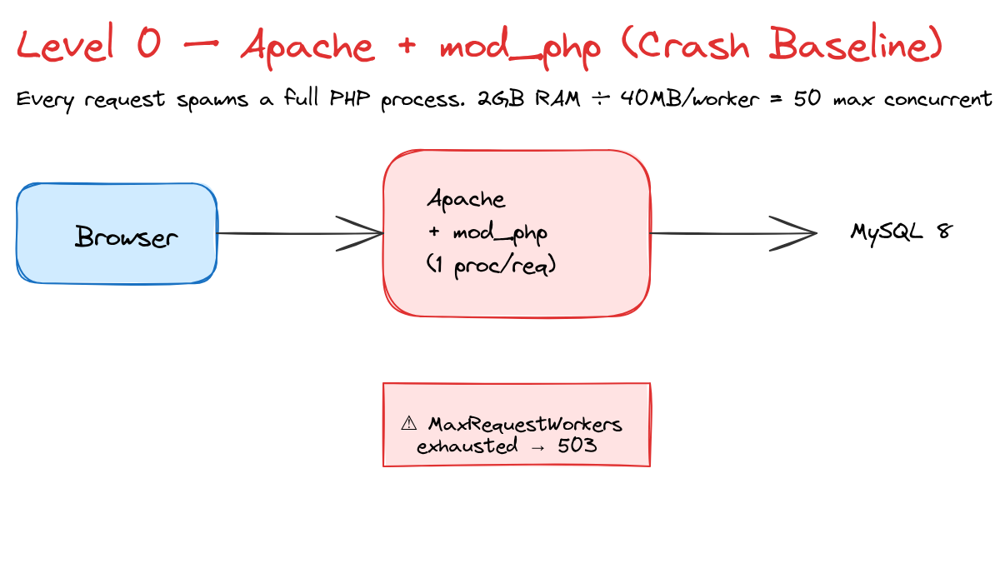
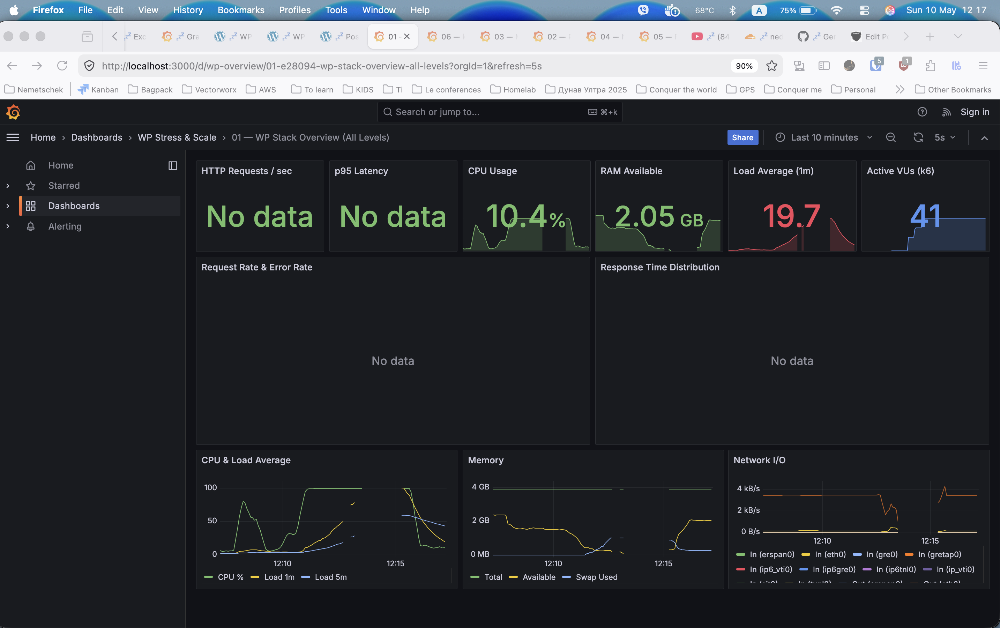
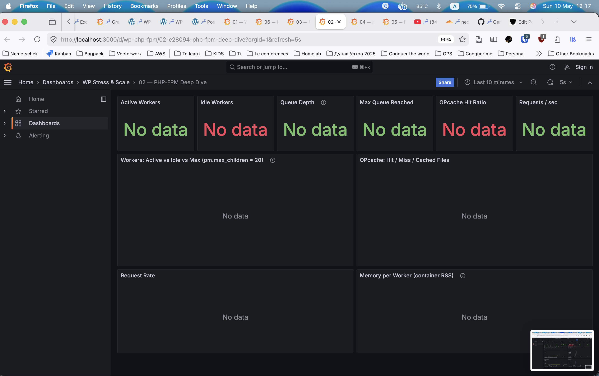
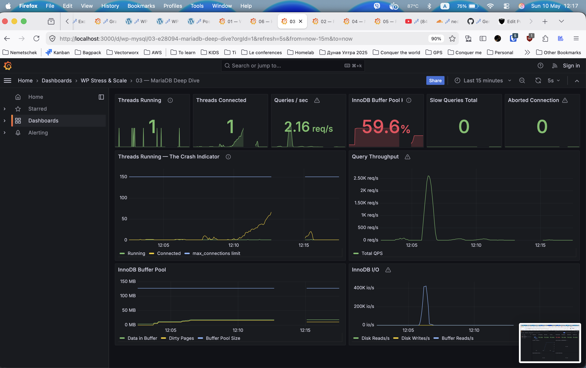
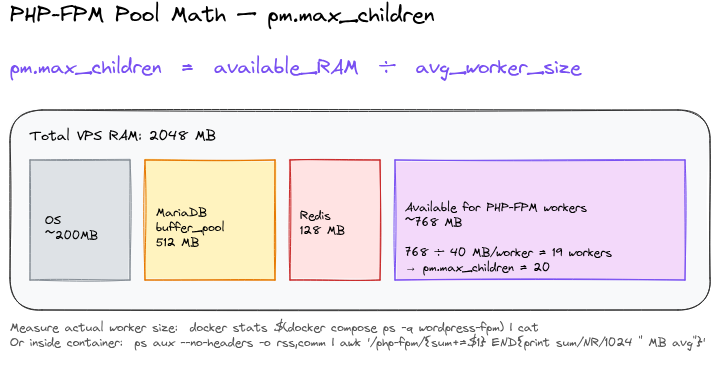
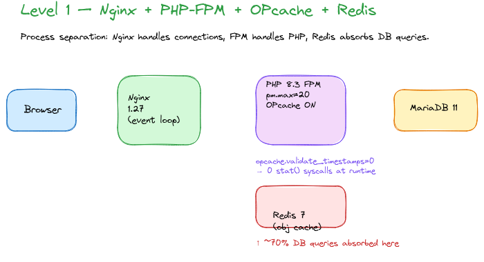
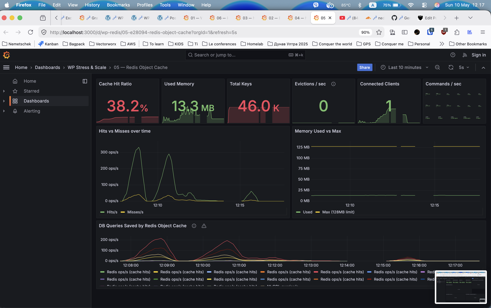
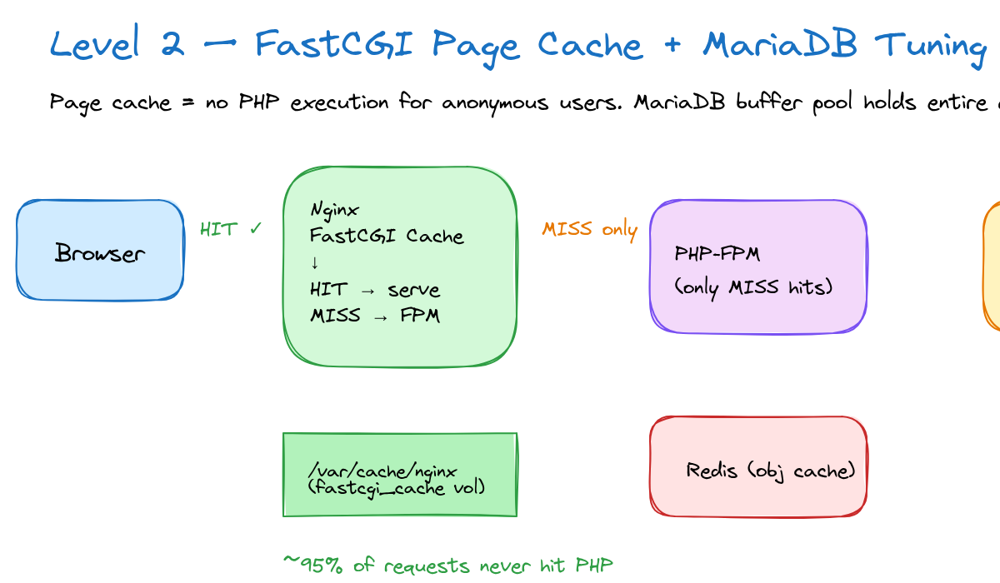
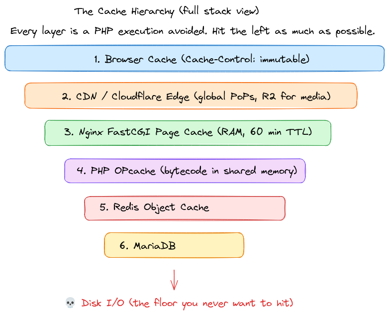
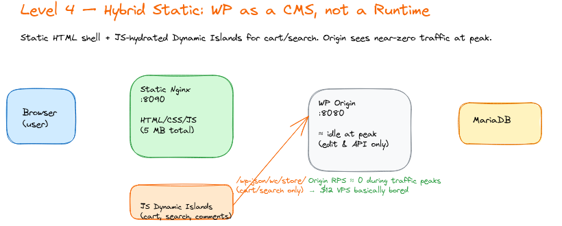

[//]: # (─────────────────────────────────────────────────────────────────)
[//]: # (  RICH VISUAL SLIDES — PoC for WordPress Europe 2026)
[//]: # ()
[//]: # (  Prerequisites:)
[//]: # (    npm install -g @marp-team/marp-cli)
[//]: # ()
[//]: # (  Export:)
[//]: # (    marp --pptx --allow-local-files SLIDES-RICH.md)
[//]: # (    marp --pdf  --allow-local-files SLIDES-RICH.md)
[//]: # (    marp --html --allow-local-files SLIDES-RICH.md && open SLIDES-RICH.html)
[//]: # ()
[//]: # (  NOTE: --allow-local-files is required for local image references.)
[//]: # ()
[//]: # (  IMAGE SLOTS — run the demo first to generate these:)
[//]: # (    results/screenshots/act1-crash-overview.png)
[//]: # (    results/screenshots/act1-crash-fpm-queue.png)
[//]: # (    results/screenshots/act1-crash-mysql-threads.png)
[//]: # (    results/screenshots/act2-level1-fpm-workers.png)
[//]: # (    results/screenshots/act2-level1-redis-hits.png)
[//]: # (    results/screenshots/act2-level1-opcache.png)
[//]: # (    results/screenshots/act3-cache-hot.png)
[//]: # (    results/screenshots/act3-fpm-offload.png)
[//]: # (    results/screenshots/act4-k6-static.png)
[//]: # ()
[//]: # (  DIAGRAM SLOTS — export from excalidraw.com as PNG:)
[//]: # (    diagrams/level-0-apache-baseline.png)
[//]: # (    diagrams/level-1-nginx-fpm-redis.png)
[//]: # (    diagrams/level-2-fastcgi-cache.png)
[//]: # (    diagrams/level-4-hybrid-static.png)
[//]: # (    diagrams/cache-hierarchy.png)
[//]: # (    diagrams/fpm-pool-math.png)
[//]: # (─────────────────────────────────────────────────────────────────)

---
marp: true
theme: default
paginate: true
style: |
  /* ── Base ── */
  @import url('https://fonts.googleapis.com/css2?family=Inter:wght@400;600;700;900&family=JetBrains+Mono:wght@400;700&display=swap');

  section {
    font-family: 'Inter', 'Segoe UI', sans-serif;
    font-size: 26px;
    background: #0d1117;
    color: #e6edf3;
    padding: 48px 64px;
  }

  /* ── Typography ── */
  h1 { font-size: 2.2em; font-weight: 900; color: #58a6ff; margin-bottom: 0.2em; }
  h2 { font-size: 1.6em; font-weight: 700; color: #58a6ff;
       border-bottom: 2px solid #e94560; padding-bottom: 10px; margin-bottom: 0.6em; }
  h3 { color: #ffa657; font-size: 1.1em; }
  strong { color: #ffa657; }
  code { font-family: 'JetBrains Mono', monospace;
         background: #161b22; color: #79c0ff; padding: 2px 8px;
         border-radius: 4px; font-size: 0.85em; border: 1px solid #30363d; }
  pre  { background: #161b22; border: 1px solid #30363d; border-radius: 8px;
         padding: 20px; font-size: 0.78em; }
  pre code { background: none; border: none; padding: 0; color: #e6edf3; }
  table { font-size: 0.82em; border-collapse: collapse; width: 100%; }
  th { background: #1f2937; color: #58a6ff; padding: 10px 14px; }
  td { padding: 8px 14px; border-bottom: 1px solid #21262d; }
  tr:nth-child(even) td { background: #161b22; }
  blockquote { border-left: 4px solid #e94560; padding-left: 16px;
               color: #8b949e; font-style: italic; margin: 16px 0; }

  /* ── Page number ── */
  section::after { color: #484f58; font-size: 0.7em; }

  /* ── Layout helpers ── */
  .cols { display: grid; grid-template-columns: 1fr 1fr; gap: 2rem; align-items: start; }
  .cols3 { display: grid; grid-template-columns: 1fr 1fr 1fr; gap: 1.5rem; }
  .card { background: #161b22; border: 1px solid #30363d; border-radius: 10px; padding: 20px; }
  .pill { display: inline-block; padding: 2px 12px; border-radius: 999px; font-size: 0.75em; font-weight: 700; }
  .pill-red   { background: #3d1a1a; color: #ff6b6b; border: 1px solid #ff6b6b; }
  .pill-green { background: #1a3d1a; color: #51cf66; border: 1px solid #51cf66; }
  .pill-blue  { background: #1a2b3d; color: #58a6ff; border: 1px solid #58a6ff; }
  .pill-gold  { background: #3d2e1a; color: #ffa657; border: 1px solid #ffa657; }

  /* ── Slide themes ── */
  section.title {
    background: radial-gradient(ellipse at 30% 50%, #1a2744 0%, #0d1117 60%);
    display: flex; flex-direction: column; justify-content: center; text-align: center;
  }
  section.title h1 { font-size: 2.8em; color: #fff; text-shadow: 0 0 40px #58a6ff88; }
  section.title h2 { border: none; color: #8b949e; font-weight: 400; font-size: 1.1em; }

  section.act {
    background: radial-gradient(ellipse at center, #1a2744 0%, #0d1117 70%);
    display: flex; flex-direction: column; justify-content: center; align-items: center;
    text-align: center;
  }
  section.act h1 { font-size: 5em; color: #58a6ff; margin: 0; }
  section.act h2 { border: none; font-size: 1.8em; color: #e6edf3; }
  section.act h3 { color: #8b949e; font-size: 1.1em; }
  section.act .act-icon { font-size: 4em; margin-bottom: 0.2em; }

  section.crash {
    background: radial-gradient(ellipse at center, #2d0f0f 0%, #0d1117 70%);
  }
  section.crash h1, section.crash h2 { color: #ff6b6b; }

  section.win {
    background: radial-gradient(ellipse at center, #0f2d0f 0%, #0d1117 70%);
  }
  section.win h1, section.win h2 { color: #51cf66; }

  section.screenshot h2 { font-size: 1.1em; margin-bottom: 0.3em; }
  section.screenshot { padding: 24px 40px; }

  /* ── Metric boxes ── */
  .metric { text-align: center; padding: 16px; }
  .metric .num { font-size: 2.4em; font-weight: 900; line-height: 1; }
  .metric .lbl { font-size: 0.7em; color: #8b949e; margin-top: 4px; }
  .metric-red .num { color: #ff6b6b; }
  .metric-green .num { color: #51cf66; }
  .metric-blue .num { color: #58a6ff; }
  .metric-gold .num { color: #ffa657; }
---

<!-- _class: title -->

# Stress Testing and Scaling WordPress
## on a $12 VPS

<br>

**Nedko Hristov** · Senior DevOps Engineer @ Nemetschek Bulgaria
WordPress Europe 2026 · Kraków 🇵🇱

<br>

`github.com/NedkoHristov/WordPress-Europe-2026`
> `docker compose up` — reproduce every number in this talk

---

## The setup

<div class="cols">
<div>

**The hardware**
<div class="card">

💻 2 vCPU · 2 GB RAM · 20 GB SSD
💰 ~$12/month (Hetzner CX22)
🐳 Docker Desktop (same constraints)

</div>

<br>

**The WordPress site**
<div class="card">

📝 2,500 posts · 500 WooCommerce products
🗄️ ~6,000 revisions in DB
🧹 Realistic bloat: transients, orphaned meta
🛍️ WooCommerce + Yoast SEO active

</div>

</div>
<div>

**The load generator**
<div class="card">

⚡ k6 — open source, Grafana Labs
📈 Black Friday ramp: 10 → 500 VUs
⏱️ 14-minute scenario
📊 Metrics → Prometheus → Grafana (live)

</div>

<br>

**The observability**
<div class="card">

6 Grafana dashboards auto-provisioned:
Overview · PHP-FPM · MariaDB
Nginx Cache · Redis · k6 Live

</div>

</div>
</div>

---

## The journey

| Level | Stack | Key unlock |
|---|---|---|
| <span class="pill pill-red">0</span> Apache + mod_php | Crash baseline | — |
| <span class="pill pill-blue">1</span> Nginx + FPM + OPcache + Redis | Stops the crash | Zero-cost reconfig |
| <span class="pill pill-blue">2</span> Level 1 + FastCGI cache + MariaDB | 95% PHP bypass | Zero-cost reconfig |
| <span class="pill pill-gold">3</span> Level 2 + Cloudflare CDN | Edge absorbs load | Free tier |
| <span class="pill pill-green">4</span> Level 2 + Static export | WP as CMS only | Zero-cost reconfig |

<br>

> **Same hardware. Same site. Same load.**
> The difference is entirely architectural.

---

## Observability architecture

```
k6 ──remote-write──▶ Prometheus ◀── node-exporter (CPU/RAM)
                          │       ◀── cadvisor      (containers)
                          │       ◀── mysqld-exporter
                          │       ◀── php-fpm-exporter
                          │       ◀── nginx-exporter
                          │       ◀── redis-exporter
                          ▼
                       Grafana
                    6 dashboards
                    (live during demo)
```

<br>

> Every number you see on screen is a **real metric from a real process.**
> No synthetic benchmarks. No cherry-picked results.

---

<!-- _class: act -->

<div class="act-icon">💥</div>

# ACT I
## The Crash
### Level 0 — Apache + mod_php

---

## Level 0 — How Apache prefork works



**Each connection = one process**

```
Browser connects
  → Apache forks a worker
    → worker loads PHP into memory
      → PHP runs WordPress
        → MySQL query
          → response sent
            → worker stays alive (idle)
              waiting for next request
```

**The math:**
- Each worker: ~32 MB RAM
- 2 GB VPS − OS overhead = ~1.5 GB for PHP
- **Maximum workers: ~47**

> Worker 48: queue.
> Worker 100: **503 Service Unavailable**

---

<!-- _class: screenshot -->

## Black Friday ramp — the timeline

| Time | VUs | Event | Dashboard |
|---|---|---|---|
| 1 min | 10 | ✅ All green, p95 < 200ms | Overview |
| 3 min | 50 | ⚠️ CPU climbing, Load > 2 | Overview |
| 4 min | 80–100 | 🔴 FPM saturated, queue forming | PHP-FPM |
| 4:30 | 100 | 🔴 MySQL threads spike | MariaDB |
| **5 min** | **100–150** | **💀 CRASH — 503s, load > 10** | **Overview** |
| 5:30 | 150+ | k6 error rate > 50% | k6 Live |

<br>

```bash
make load-crash   # 0→500 VUs · Black Friday ramp
```

---

<!-- _class: crash screenshot -->

## 📸 The crash — Grafana Overview



<div class="cols3" style="margin-top:12px">
<div class="metric metric-red"><div class="num">100%</div><div class="lbl">CPU</div></div>
<div class="metric metric-red"><div class="num">>10</div><div class="lbl">Load Average</div></div>
<div class="metric metric-red"><div class="num">>50%</div><div class="lbl">Error Rate</div></div>
</div>

---

<!-- _class: crash screenshot -->

## 📸 PHP-FPM saturated



**What you see:**
- Active Workers = **20** (max)
- Queue Depth **> 0** and growing
- New connections start timing out

<br>

**pm.max_children = 20**
The hard limit. Once all workers are
busy — the 21st request waits.
Once the queue fills — it fails.

---

<!-- _class: crash screenshot -->

## 📸 MariaDB overwhelmed



**Threads Running spike**

The database bottleneck:
- No object cache → every `get_option()` hits MySQL
- 300+ queries per page request
- Buffer pool too small (128 MB) → disk I/O
- Threads pile up → deadlocks → timeouts

> **Threads Running > 10 = the crash indicator**

---

## The Apache prefork math

$$\text{Max safe workers} = \frac{\text{RAM} - \text{OS overhead}}{\text{RAM per PHP process}}$$

$$= \frac{2048 \text{ MB} - 512 \text{ MB}}{32 \text{ MB}} = \textbf{47 workers}$$

<br>



<br>

> Worker 48 goes into the queue.
> Worker 100 gets a 503.
> This is not a bug — it's arithmetic.

---

<!-- _class: act -->

<div class="act-icon">🩹</div>

# ACT II
## Stop the Bleeding
### Level 1 — Nginx + PHP-FPM + OPcache + Redis

---

## Level 1 — How it's different



**Three fundamental changes:**

**1. Nginx (event-driven)**
One thread handles 10,000+ connections.
Zero RAM per idle connection.

**2. PHP-FPM (decoupled)**
Workers only spawn for PHP work.
Not one-per-connection — one-per-request.

**3. OPcache + Redis**
- OPcache: compiled PHP bytecode in shared memory
- Redis: DB query results in RAM

---

## OPcache — the biggest free win

<div class="cols">
<div class="card">

### ❌ Without OPcache (Level 0)

```
Request arrives
→ PHP reads .php file from disk
→ Lexer tokenizes source
→ Parser builds AST
→ Compiler generates opcodes
→ Execute opcodes
→ Response

Repeat for EVERY request.
```

</div>
<div class="card">

### ✅ With OPcache (Level 1)

```
First request:
→ compile → store in shared memory

Every request after:
→ read opcodes from RAM
→ Execute
→ Response

Zero disk. Zero compilation.
```

</div>
</div>

<br>

> **98%+ cache hit rate within 30 seconds of first load**
> `opcache.validate_timestamps=0` in production — never re-check disk

---

<!-- _class: screenshot -->

## 📸 OPcache hit rate in Grafana


**What to look for:**

- Hit Rate: **> 98%**
- Cached Scripts: stabilises at ~200
- Memory Used: flat line

<br>

This chart pays for the entire
talk. One config line:
```ini
opcache.enable = 1
opcache.validate_timestamps = 0
```

---

## Redis object cache

**Without Redis:** every `get_option()` → MySQL → disk → PHP array
WordPress calls `get_option()` **300+ times per request**.

**With Redis:**
```
wp_get_option('siteurl') → Redis GET → 0.1ms ← from RAM
wp_query($args)          → Redis GET → 0.1ms ← cached result
```

```bash
wp plugin install redis-cache --activate
wp redis enable
```

**Result: ~70% of DB queries served from memory**

> Hit ratio climbs as cache warms up.
> After 1 minute of traffic: most reads never reach MySQL.

---

<!-- _class: screenshot -->

## 📸 Redis hit ratio climbing



**Grafana Redis dashboard**

- Hit Ratio: climbing to **70%+**
- Memory Used: grows then stabilises
- DB Queries Saved panel: the savings accumulate

<br>

Every hit in Redis = one query
MySQL didn't have to run.

---

<!-- _class: screenshot -->

## 📸 Same load — Level 1 FPM workers


**What changed:**

- Active Workers: stays **< 15** at 200 VU
- Queue Depth: **0** ← this is why it doesn't crash
- Nginx queues connections, workers do real work

<br>

Level 0 crashed at **80 VU**.
Level 1 handles **300+ VU** comfortably.
Same hardware. Different architecture.

---

## Level 0 vs Level 1 — by the numbers

| Metric | Level 0 | Level 1 | Change |
|---|---|---|---|
| Max stable VUs | ~50 | 300+ | **6×** |
| p95 latency @ 100 VU | timeout | ~180ms | ✅ |
| CPU @ 200 VU | 100% (dead) | ~60% | ✅ |
| OPcache hit rate | 0% | 98%+ | ✅ |
| Redis hit rate | 0% | ~70% | ✅ |
| FPM queue depth | N/A | **0** | ✅ |
| DB queries/req | 300+ | ~90 | **3× fewer** |

<br>

> **Cost of this upgrade: $0**
> `make level-1` — 10 seconds.

---

<!-- _class: act -->

<div class="act-icon">🚀</div>

# ACT III
## Cache Everything
### Level 2 — FastCGI page cache + MariaDB tuning

---

## The key insight

> **Most WordPress page requests are identical for every anonymous visitor.**
> Home page. Category archive. Blog post.
> Same HTML. Over and over. Rendered by PHP every single time.

**FastCGI page cache:**
```
First anonymous visitor  → PHP runs → page cached to disk
Every visitor after that → Nginx reads cache → 8ms TTFB
                          PHP never runs
                          MySQL never runs
```

<div class="cols">
<div class="card">

**Cached (anonymous):** ✅
- Homepage
- Category pages
- Blog posts
- Shop pages

</div>
<div class="card">

**Bypassed (dynamic):** 🔄
- Logged-in users
- Cart / Checkout
- POST requests
- Admin panel

</div>
</div>

---

## Level 2 architecture



```nginx
fastcgi_cache_path /var/cache/nginx
  keys_zone=WORDPRESS:100m
  inactive=60m;

# Bypass for dynamic content
if ($http_cookie ~* 
  "wordpress_logged_in|
   woocommerce_cart|
   woocommerce_session") {
  set $skip_cache 1;
}
```

**Result:**
`X-Cache-Status: HIT`
→ PHP never runs for this request

---

<!-- _class: screenshot -->

## 📸 Cache warming in real time


**Nginx Cache dashboard — donut chart**

| Time | HIT % |
|---|---|
| 0:00 | 0% — all MISS |
| 0:30 | ~40% |
| 1:00 | ~70% |
| **2:00** | **90%+** ← screenshot this |

<br>

Watch the green slice grow.
That green = PHP not running.

---

<!-- _class: screenshot -->

## 📸 PHP-FPM offload


<br>

> **Top line: total RPS (all traffic)**
> **Bottom line: PHP-FPM RPS (cache misses only)**
>
> The gap between them = **cache absorbing the load**

---

## The full cache hierarchy



---

## MariaDB tuning

<div class="cols">
<div>

**Level 0 (baseline)**
```ini
# 00-baseline.cnf
innodb_buffer_pool_size = 128M
max_connections = 151
```

Problems:
- 128M pool → constant disk I/O
- Every query reads from disk
- Slow queries go undetected

</div>
<div>

**Level 2 (tuned)**
```ini
# 10-tuned.cnf
innodb_buffer_pool_size = 512M
innodb_flush_log_at_trx_commit = 2
slow_query_log = 1
long_query_time = 0.5
```

Wins:
- DB fits in RAM → < 1ms reads
- Commits batched (1×/sec vs every write)
- Slow queries identified + fixed

</div>
</div>

---

<!-- _class: win screenshot -->

## 📸 Level 2 — The server is bored


<div class="cols3" style="margin-top:12px">
<div class="metric metric-green"><div class="num">8ms</div><div class="lbl">TTFB (was 800ms)</div></div>
<div class="metric metric-green"><div class="num">15%</div><div class="lbl">CPU @ 500 VU</div></div>
<div class="metric metric-green"><div class="num">0%</div><div class="lbl">Error Rate</div></div>
</div>

---

<!-- _class: act -->

<div class="act-icon">⚡</div>

# ACT IV
## The Hybrid Static Leap
### Level 4 — WordPress as a CMS, not a runtime

---

## The static export concept



**Build time** (once, or on publish):
```bash
make static-build
# wget crawls every page
# saves HTML to static/export/
```

**Runtime** (every request):
```
Browser → Nginx
  ├── /              → static HTML (0ms PHP)
  ├── /shop/         → static HTML (0ms PHP)  
  └── /wp-json/cart  → proxy to WordPress
     /checkout       → proxy to WordPress
```

**WordPress only runs for:**
- Cart, Checkout, Account (dynamic islands)
- Admin editing (publishing new content)

---

<!-- _class: win screenshot -->

## 📸 500 VUs — origin CPU at 0%


<div class="cols3" style="margin-top:12px">
<div class="metric metric-green"><div class="num">4ms</div><div class="lbl">p95 latency</div></div>
<div class="metric metric-green"><div class="num">500</div><div class="lbl">VUs (no crash)</div></div>
<div class="metric metric-green"><div class="num">0%</div><div class="lbl">WP CPU used</div></div>
</div>

---

## The full picture

| Level | Stack | Stable VUs | p95 | Cost |
|---|---|---|---|---|
| **0** | Apache + mod_php | ~50 | 💥 crash | baseline |
| **1** | Nginx + FPM + OPcache + Redis | 300+ | ~180ms | **$0** |
| **2** | Level 1 + FastCGI + MariaDB | 500+ | ~45ms | **$0** |
| **3** | Level 2 + Cloudflare CDN | ∞ (edge) | ~20ms | ~$0–20/mo |
| **4** | Static export | 500+ | ~4ms | **$0** |

<br>

> **Every improvement except Cloudflare costs $0 in infrastructure.**
> It was configuration, architecture, and understanding the bottleneck.

---

## Lessons learned

<div class="cols">
<div>

**1. Measure first**
<div class="card">

Set up Grafana + Prometheus
**before** you need it.
You cannot fix what you cannot see.

</div>

<br>

**2. The three WP cache layers**
<div class="card">

```
OPcache  → PHP bytecode  → always on
Redis    → DB queries    → wp redis enable
FastCGI  → Full pages    → nginx config
```

Most sites use 0 or 1.
All three together = a different machine.

</div>

</div>
<div>

**3. pm.max_children is math**
<div class="card">

$$\frac{\text{RAM for PHP}}{\text{MB per worker}}$$

Over-provision → OOM killer.
Under-provision → queue.
**Do the calculation.**

</div>

<br>

**4. DB is usually the bottleneck**
<div class="card">

- `innodb_buffer_pool_size` = 70% of RAM
- Enable `slow_query_log`
- Watch **Threads Running**
- Run `wp db optimize` regularly

</div>

</div>
</div>

---

## The tools — all free

<div class="cols">
<div>

| Tool | Role |
|---|---|
| **k6** | Load generator |
| **Prometheus** | Metrics storage |
| **Grafana** | Dashboards (6 built-in) |
| **Redis** | Object cache |
| **PHP OPcache** | Bytecode cache |

</div>
<div>

| Tool | Role |
|---|---|
| **Nginx FastCGI** | Full-page cache |
| **MariaDB 11** | Tuned DB |
| **Simply Static** | Static export |
| **Cloudflare** | CDN + Zero Trust |
| **Docker Compose** | Reproducible demo |

</div>
</div>

<br>
<div class="card" style="text-align:center;padding:16px">

🐙 **github.com/NedkoHristov/WordPress-Europe-2026**

`docker compose up` — everything starts. Every demo is reproducible.
One `make reset` to wipe state. One `make level-0` to start over.

</div>

---

<!-- _class: title -->

# Thank you!

<br>

**Nedko Hristov**
Senior DevOps Engineer @ Nemetschek Bulgaria

🐙 `github.com/NedkoHristov/WordPress-Europe-2026`

<br>
<br>

### Questions?

<br>

> *"The best time to add monitoring was before the crash.*
> *The second best time is right now."*
